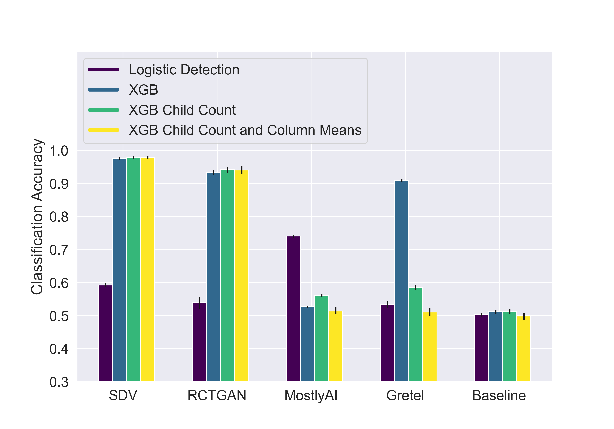

# A Survey and Empirical Comparison of Synthetic Data Generation Methods for Relational Data: Visualized results

## Single Table Visualizations

### Dataset: Biodegradability, Table: Atom

### Dataset: Biodegradability, Table: Molecule

### Dataset: Mutagenesis, Table: Atom

### Dataset: Mutagenesis, Table: Molecule

### Dataset: Rossmann Store Sales, Table: Store

### Dataset: Telstra Competition Dataset, Table: Train

### Dataset: Zurich, Table: Customers

### Dataset: Zurich, Table: Policies

## Multi Table Visualizations

### Dataset: Biodegradability

### Dataset: Mutagenesis

### Dataset: Rossmann Store Sales

### Dataset: Telstra Competition Dataset

### Dataset: Zurich

## Privacy Visualizations 

### Zurich Customer & Policy Data: Distance to Closest Record

### Zurich Customer & Policy Data: Nearest Neighbor Distance Ratio
